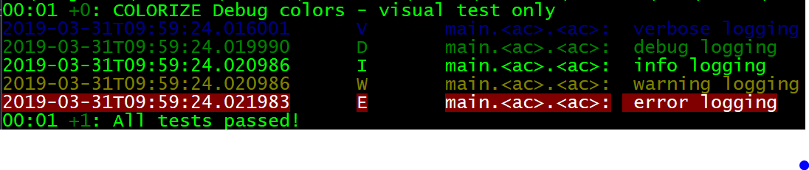

# fimber 

Extensible logging for Dart and Flutter.

Package is based on famous Android logging library API - [Timber](https://github.com/JakeWharton/timber), this is library for simplify logging for Flutter.
Using similar (as far as Dart lang allows) method API with same concepts for tree and planting logging tree.
Also check out `flutter_fimber` which extends `fimber` to platform specific output and logging style.

## Getting Started

To start add using it:
### Add `fimber` to `pubspec.yaml` 
```yaml
dependencies:
  fimber: ^0.4.4
  ```
- remember about import in file you plan to use Fimber
```dart
import 'package:fimber/fimber.dart';

```

### Initialize logging tree on start of your application

```dart

void main() {
  Fimber.plantTree(DebugTree());
  // app code here ...
  
  // DebugTree options for time elapsed
  // by default DebugTree will output timestamp of the VM/Flutter app
  // to enable elapsed time since planting the tree log
  Fimber.plantTree(DebugTree.elapsed());
  
}
 
```

### Start using it with static methods:

```dart
import 'fimber.dart';


void main() {
  var parameter = 343.0;
  // use directly
  Fimber.i("Test message $argument");
  Fimber.i("Extra error message", ex: Exception("Test thorwable"));
  
  // other log levels
  Fimber.d("DEBUG");
  Fimber.v("VERBOSE");
  Fimber.w("WARN");
  
  try {
    throw Exception("Exception thrown");
  } catch (e, stacktrace) {
    // providing `stacktrace` will better show where issue was thrown
    // if not provided will use log line location.
    Fimber.i("Error caught.", ex: e, stacktrace: stacktrace);
  }
}

```

This will log the value and grab a TAG from stacktrace - that is little costly and if more logs will be done per second.

### Colorize logs - `ColorizeStyle`

`useColors` property set to true will use default colors of the logos, you can change the mapping with in `colorizeMap` for `DebugTree` and `CustomFormatTree`
The `useColors` by default is disabled.

`ColorizeStyle` Aggregates list of `AnsiStyle` so you can combine styles together.

`AnsiStyle` is combination of [`AnsiColor`](lib/colorize.dart) and [`AnsiSelection`](lib/colorize.dart) values

Here is output of test output.




### Create tagged version of Fimber 

And use its instance inside class, you can create logger for a dart file or for a class.

```dart
var logger = FimberLog("MY_TAG");

void main() {
  
  logger.d("Test message");
}

// or inside a class
class SomeBloc {
  var logger = FimberLog("SomeBloc");
  String fetchMessage() {
    logger.d("About to fetch some data.");
    //...
    var data = "load something";

    logger.d("Retrived data (len = ${data.length}");
    return data;
  }
}
```

### Use block function and pass method that uses logger.

Use this function to log multiple messages with same tag, allows optional return value.
Due to nature of auto-tag generation from stacktrace this block only does it once and create local FimberLog instance to pass into the anonymous method.

```dart
    var someMessage = "Test message from inside of block";
    var output = Fimber.block((log) {
      log.d("Started block");
      var i = 0;
      for (i = 0; i < 10; i++) {
        log.d("$someMessage, value: $i");
      }
      log.i("End of block");
      return i;
    });
```

## **Deprecated** moved to [`fimber_io`](https://pub.dev/packages/fimber_io/) package

### Custom line formatters 

Use custom line formatters to define your logging format.

```dart
import 'package:fimber_io/fimber_io.dart';

...

    Fimber.plantTree(FimberFileTree("my-Log-File.txt",
        logFormat: "${CustomFormatTree.TIME_ELAPSED_TOKEN} ${CustomFormatTree
            .MESSAGE_TOKEN} ${CustomFormatTree.TIME_STAMP_TOKEN}"
    ));
```

Use file log tree - the logs will go to a log file (Useful in DartVM apps).
There are log rolling with size and time/date interval, so it is possible to setup log output per hour/day or any other time.

see: `SizeRollingFileTree` or `TimedRollingFileTree` or use abstract class `RollingFileTree` to create your own version of rolling log file.


## TODO - road map

- See  [Issues on Github](https://github.com/magillus/flutter-fimber/issues)
- Add Crashlytics plugin (maybe other remote logger tools) with [flutter_crashlytics](https://pub.dartlang.org/packages/flutter_crashlytics)

## Licence

```

   Copyright 2018 Mateusz Perlak

   Licensed under the Apache License, Version 2.0 (the "License");
   you may not use this file except in compliance with the License.
   You may obtain a copy of the License at

       http://www.apache.org/licenses/LICENSE-2.0

   Unless required by applicable law or agreed to in writing, software
   distributed under the License is distributed on an "AS IS" BASIS,
   WITHOUT WARRANTIES OR CONDITIONS OF ANY KIND, either express or implied.
   See the License for the specific language governing permissions and
   limitations under the License.
```